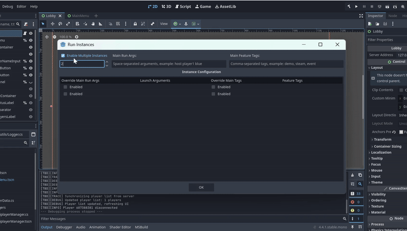
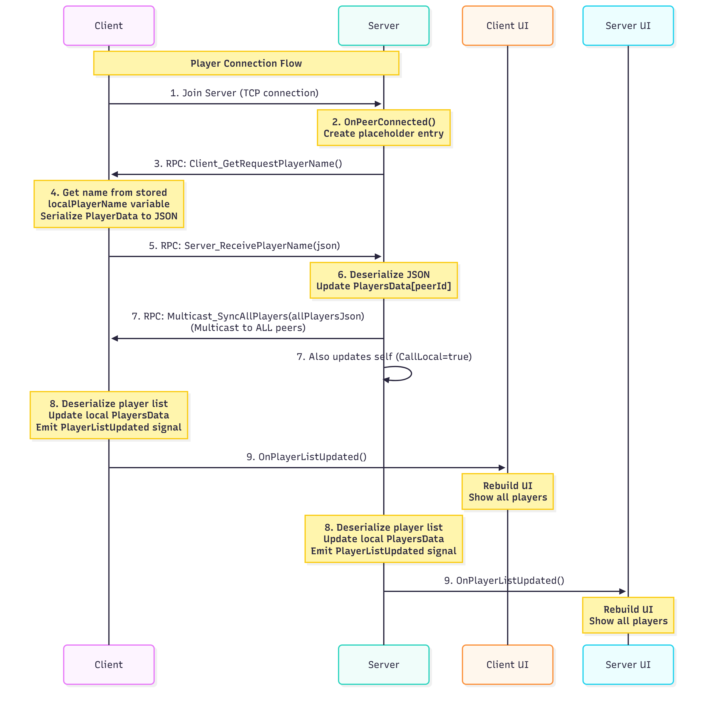
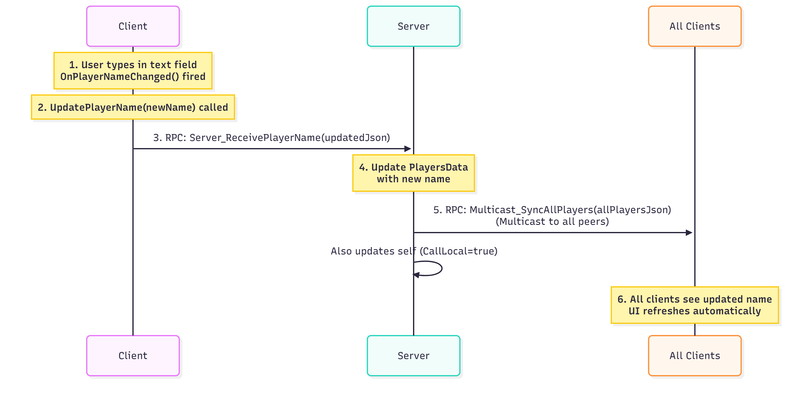
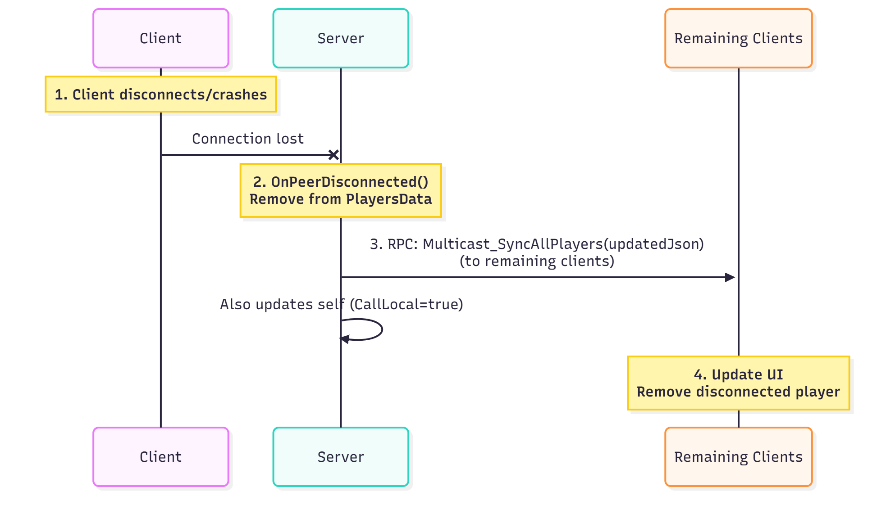

# Godot 4 Multiplayer Lobby Example (C#)

A minimal, well-documented example demonstrating **RPC-based player name synchronization** in a multiplayer lobby using Godot 4 with C#.




## 🏗️ Architecture Overview

### Project Structure

```
Godot4MultiplayerLobby/
├── src/
│   ├── managers/
│   │   └── MultiplayerManager.cs    # Autoload singleton managing connections & RPC
│   ├── data/
│   │   └── PlayerData.cs             # Player data model with JSON serialization
│   ├── ui/
│   │   └── Lobby.cs                  # Unified lobby controller (MVC pattern)
│   └── utils/
│       └── Logger.cs                 # Simple logging utility
├── scenes/
    ├── MainMenu.tscn                 # Entry point scene
    └── Lobby.tscn                    # Lobby UI scene
```

### MVC Pattern Implementation

**Model**:
- `PlayerData`: Data structure representing a player
- `MultiplayerManager.PlayersData`: Dictionary storing all connected players

**View**:
- `Lobby.tscn`: UI elements (buttons, labels, text input)

**Controller**:
- `Lobby.cs`: Handles user input, updates model, refreshes view


## Development Tips

- Use multiple instances of the project to run a host and a client simultaneously without opening two separate editors, saving development time.
- Check my other repository for an example of using command-line arguments to launch a multiplayer-ready game without needing to create or join a server, further saving development time.


## RPC Flow Detailed Documentation

This document provides a deep dive into the RPC (Remote Procedure Call) flow used in this multiplayer lobby system.


## Complete Player Connection Flow

### Flow Diagram




### Step 1: Server Opens Connection

**Location**: `Lobby.cs` → `OnHostPressed()`

```csharp
MultiplayerManager.Instance.HostServer("127.0.0.1");
```

**What Happens**:
- Creates `ENetMultiplayerPeer`
- Calls `peer.CreateClient(ip, port)`
- Sets `Multiplayer.MultiplayerPeer = peer`
- Godot automatically attempts connection


### Step 2: Client Initiates Connection

**Location**: `Lobby.cs` → `OnJoinPressed()`

```csharp
MultiplayerManager.Instance.JoinServer("127.0.0.1");
```

**What Happens**:
- Creates `ENetMultiplayerPeer`
- Calls `peer.CreateClient(ip, port)`
- Sets `Multiplayer.MultiplayerPeer = peer`
- Godot automatically attempts connection


### Step 3: Server Detects Connection

**Location**: `MultiplayerManager.cs` → `OnPeerConnected()`

**Trigger**: Godot's built-in `Multiplayer.PeerConnected` signal fires

```csharp
private void OnPeerConnected(long peerId)
{
    if (Multiplayer.IsServer())
    {
        // Create placeholder
        PlayersData[peerId] = new PlayerData("<Connecting...>", peerId);
        
        // Ask client for their name
        RpcId(peerId, MethodName.Client_GetRequestPlayerName);
    }
}
```

**Network Traffic**:
```
SERVER --[RPC: Client_GetRequestPlayerName()]--> CLIENT (peerId)
```

### Step 4: Client Receives Request

**Location**: `MultiplayerManager.cs` → `Client_GetRequestPlayerName()`

```csharp
[Rpc(MultiplayerApi.RpcMode.AnyPeer, CallLocal = false)]
private void Client_GetRequestPlayerName()
{
    string localPlayerName = GetPlayerNameFromUI();
    long localPeerId = Multiplayer.GetUniqueId();
    
    PlayerData playerData = new PlayerData(localPlayerName, localPeerId);
    
    // Send to server (ID 1 is always the server)
    RpcId(1, MethodName.Server_ReceivePlayerName, playerData.AsJsonString());
}
```

**Why JSON?**
- `PlayerData` is a C# class (not Variant-compatible)
- RPC can only send Variant types
- Solution: Serialize to JSON string, which IS Variant-compatible

**Network Traffic**:
```
CLIENT --[RPC: Server_ReceivePlayerName(json)]--> SERVER
```

### Step 4: Server Receives Player Data
**Location**: `MultiplayerManager.cs` → `Server_ReceivePlayerName()`

**Network Traffic**:
```
SERVER --[RPC: Multicast_SyncAllPlayers(jsonOfAllPlayers)]--> ALL CLIENTS
       --[Also runs locally on server (CallLocal = true)]
```

### Step 6: All Peers Synchronize

**Location**: `MultiplayerManager.cs` → `Multicast_SyncAllPlayers()`

```csharp
[Rpc(MultiplayerApi.RpcMode.Authority, CallLocal = true)]
private void Multicast_SyncAllPlayers(string allPlayersJson)
{
    // Update local dictionary with server's authoritative data
    PlayersData = DeserializePlayersDictionary(allPlayersJson);
    
    // Notify UI that player list changed
    EmitSignal(SignalName.PlayerListUpdated);
}
```

**Why CallLocal = true?**
- Server needs to update its own UI too *if using listen servers*
- Without it, server would send to clients but not update itself


### Step 6: UI Updates

**Location**: `Lobby.cs` → `OnPlayerListUpdated()`

```csharp
private void OnPlayerListUpdated()
{
    UpdatePlayerListUI();  // Rebuilds player list from PlayersData
}
```

**Signal Flow**:
```
MultiplayerManager.Multicast_SyncAllPlayers()
    └─> EmitSignal(PlayerListUpdated)
        └─> Lobby.OnPlayerListUpdated()
            └─> UpdatePlayerListUI()
```


## Name Update Flow

When a player changes their name in real-time:



## Disconnection Flow




### Prerequisites

- Godot 4.3+ with .NET support
- .NET 8.0 SDK

### Setup

1. Clone or download this project
2. Open in Godot 4
3. Wait for C# project to build
4. Run the project (F5)

### Testing Multiplayer Locally

1. **Run Instance 1** (Host):
   - Enter a player name (e.g., "Alice")
   - Click "Host"
   - Wait for players to join

2. **Run Instance 2** (Client):
   - Export project or run another editor instance
   - Enter a player name (e.g., "Bob")
   - Click "Join"
   - See both players in the lobby

## 🔑 Key Concepts

### Why JSON Serialization?

Godot's RPC system only supports **Variant-compatible types**. Custom C# classes like `PlayerData` cannot be sent directly via RPC. 

**Solution**: Serialize to JSON string (which is Variant-compatible), transmit, then deserialize on the other end.

```csharp
// Sending
PlayerData data = new PlayerData("Alice", 12345);
RpcId(1, MethodName.ReceivePlayerName, data.AsJsonString());

// Receiving
[Rpc]
private void ReceivePlayerName(string json)
{
    PlayerData data = PlayerData.FromJson(json);
    // Now we have our custom object back!
}
```

### Why Not MultiplayerSpawner?

`MultiplayerSpawner` is for **runtime object spawning** (like bullets, enemies, etc.), not for:
- Scene transitions
- Persistent data synchronization
- Initial lobby setup

For lobbies, use **RPC multicasts** to synchronize state across all peers.

### Autoload Persistence

`MultiplayerManager` is an **autoload singleton**, meaning:
- ✅ Persists across scene changes
- ✅ Maintains network connection when loading new scenes
- ✅ Keeps player data intact throughout game session
- ✅ Accessible from any script via `MultiplayerManager.Instance`

## 📝 Common Patterns

### Adding New Player Properties

```csharp
// 1. Update PlayerData class
public class PlayerData
{
    public string Name { get; set; }
    public long PeerId { get; set; }
    public int Score { get; set; }  // NEW
    
    public Dictionary AsDict()
    {
        return new Dictionary
        {
            ["name"] = Name,
            ["peer_id"] = PeerId,
            ["score"] = Score  // NEW
        };
    }
}

// 2. Update constructor to handle new property
public PlayerData(Dictionary dict)
{
    Name = dict["name"].AsString();
    PeerId = dict["peer_id"].AsInt64();
    Score = dict.ContainsKey("score") ? dict["score"].AsInt32() : 0;
}
```

### Updating Player Data During Game

```csharp
// Client updates their own score
public void UpdatePlayerScore(int newScore)
{
    long localPeerId = Multiplayer.GetUniqueId();
    
    if (MultiplayerManager.PlayersData.ContainsKey(localPeerId))
    {
        MultiplayerManager.PlayersData[localPeerId].Score = newScore;
        
        // Send update to server
        if (!Multiplayer.IsServer())
        {
            RpcId(1, MethodName.ReceivePlayerUpdate, 
                MultiplayerManager.PlayersData[localPeerId].AsJsonString());
        }
        else
        {
            // Server multicasts to all
            Rpc(MethodName.SyncAllPlayers, 
                SerializePlayersDictionary(MultiplayerManager.PlayersData));
        }
    }
}
```

## 🐛 Debugging Tips

### Enable Verbose Logging

The `Logger` class provides multiple log levels:

```csharp
Logger.Trace("Detailed execution flow");  // Use for step-by-step debugging
Logger.Debug("Player connected");         // Use for important events
Logger.Info("Game started");              // Use for major milestones
Logger.Warning("Low player count");       // Use for potential issues
Logger.Error("Connection failed");        // Use for critical errors
```

## 📚 Further Reading

- [Godot High-Level Multiplayer Docs](https://docs.godotengine.org/en/stable/tutorials/networking/high_level_multiplayer.html)
- [Godot RPC Documentation](https://docs.godotengine.org/en/stable/classes/class_node.html#class-node-method-rpc)
- [ENet Peer Documentation](https://docs.godotengine.org/en/stable/classes/class_enetmultiplayerpeer.html)

## 📄 License

MIT
