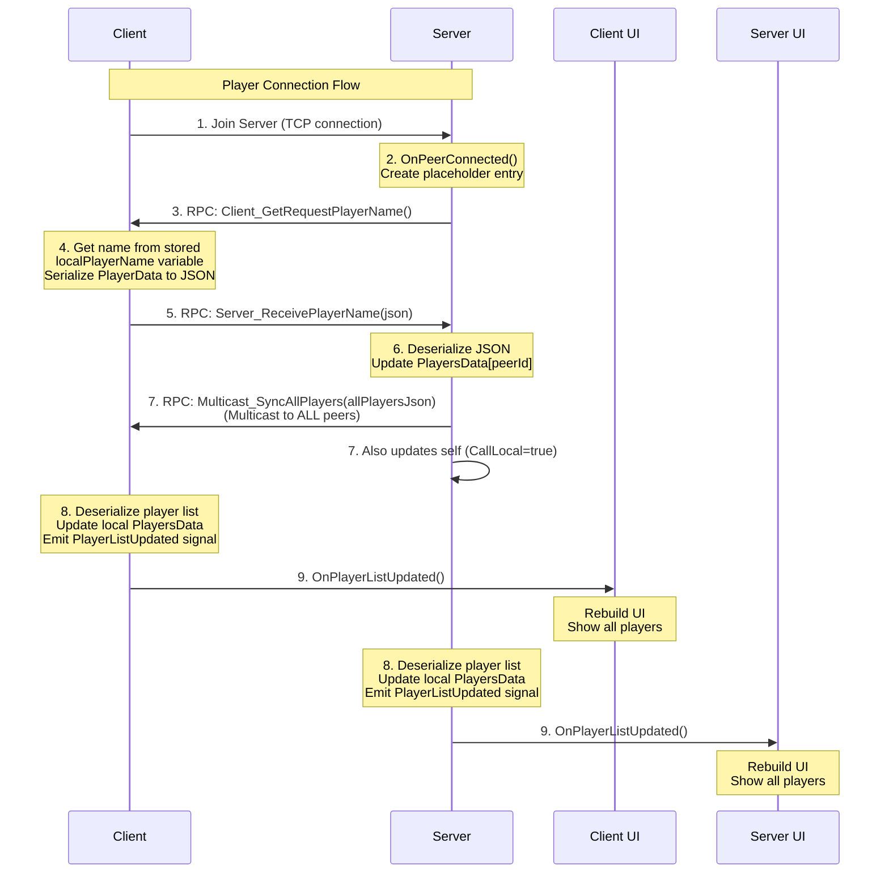
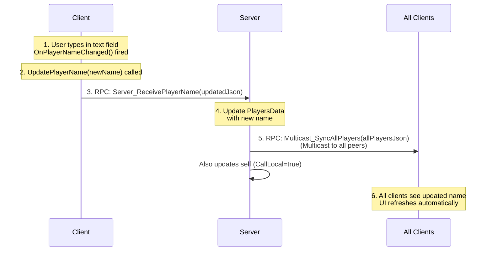
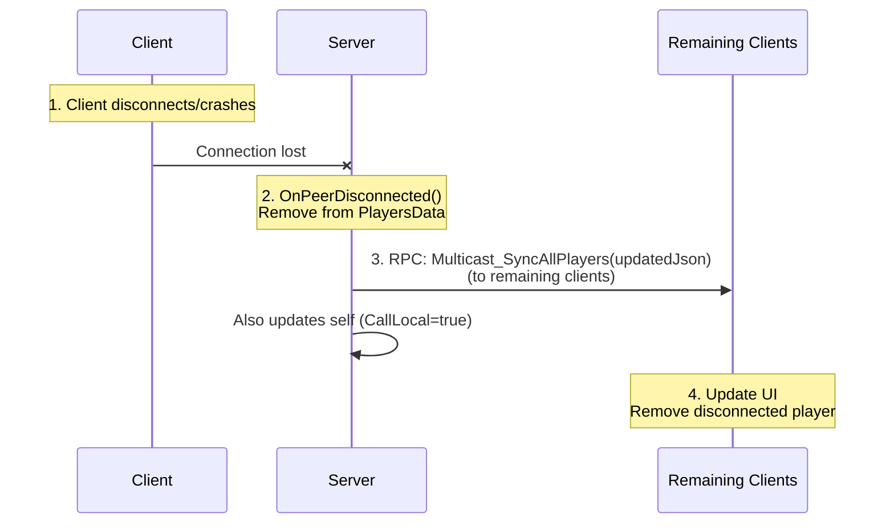

# RPC Flow Detailed Documentation

## Overview

This document provides a deep dive into the RPC (Remote Procedure Call) flow used in this multiplayer lobby system.


## Complete Player Connection Flow


### Step 1: Server Opens Connection

**Location**: `Lobby.cs` → `OnHostPressed()`

```csharp
MultiplayerManager.Instance.HostServer("127.0.0.1");
```

**What Happens**:
- Creates `ENetMultiplayerPeer`
- Calls `peer.CreateClient(ip, port)`
- Sets `Multiplayer.MultiplayerPeer = peer`
- Godot automatically attempts connection


### Step 1: Client Initiates Connection

**Location**: `Lobby.cs` → `OnJoinPressed()`

```csharp
MultiplayerManager.Instance.JoinServer("127.0.0.1");
```

**What Happens**:
- Creates `ENetMultiplayerPeer`
- Calls `peer.CreateClient(ip, port)`
- Sets `Multiplayer.MultiplayerPeer = peer`
- Godot automatically attempts connection


### Step 2: Server Detects Connection

**Location**: `MultiplayerManager.cs` → `OnPeerConnected()`

**Trigger**: Godot's built-in `Multiplayer.PeerConnected` signal fires

```csharp
private void OnPeerConnected(long peerId)
{
    if (Multiplayer.IsServer())
    {
        // Create placeholder
        PlayersData[peerId] = new PlayerData("<Connecting...>", peerId);
        
        // Ask client for their name
        RpcId(peerId, MethodName.Client_GetRequestPlayerName);
    }
}
```

**Network Traffic**:
```
SERVER --[RPC: Client_GetRequestPlayerName()]--> CLIENT (peerId)
```

### Step 3: Client Receives Request

**Location**: `MultiplayerManager.cs` → `Client_GetRequestPlayerName()`

```csharp
[Rpc(MultiplayerApi.RpcMode.AnyPeer, CallLocal = false)]
private void Client_GetRequestPlayerName()
{
    string localPlayerName = GetPlayerNameFromUI();
    long localPeerId = Multiplayer.GetUniqueId();
    
    PlayerData playerData = new PlayerData(localPlayerName, localPeerId);
    
    // Send to server (ID 1 is always the server)
    RpcId(1, MethodName.Server_ReceivePlayerName, playerData.AsJsonString());
}
```

**Why JSON?**
- `PlayerData` is a C# class (not Variant-compatible)
- RPC can only send Variant types
- Solution: Serialize to JSON string, which IS Variant-compatible

**Network Traffic**:
```
CLIENT --[RPC: Server_ReceivePlayerName(json)]--> SERVER
```

### Step 4: Server Receives Player Data
**Location**: `MultiplayerManager.cs` → `Server_ReceivePlayerName()`

**Network Traffic**:
```
SERVER --[RPC: Multicast_SyncAllPlayers(jsonOfAllPlayers)]--> ALL CLIENTS
       --[Also runs locally on server (CallLocal = true)]
```

### Step 5: All Peers Synchronize

**Location**: `MultiplayerManager.cs` → `Multicast_SyncAllPlayers()`

```csharp
[Rpc(MultiplayerApi.RpcMode.Authority, CallLocal = true)]
private void Multicast_SyncAllPlayers(string allPlayersJson)
{
    // Update local dictionary with server's authoritative data
    PlayersData = DeserializePlayersDictionary(allPlayersJson);
    
    // Notify UI that player list changed
    EmitSignal(SignalName.PlayerListUpdated);
}
```

**Why CallLocal = true?**
- Server needs to update its own UI too *if using listen servers*
- Without it, server would send to clients but not update itself


### Step 6: UI Updates

**Location**: `Lobby.cs` → `OnPlayerListUpdated()`

```csharp
private void OnPlayerListUpdated()
{
    UpdatePlayerListUI();  // Rebuilds player list from PlayersData
}
```

**Signal Flow**:
```
MultiplayerManager.Multicast_SyncAllPlayers()
    └─> EmitSignal(PlayerListUpdated)
        └─> Lobby.OnPlayerListUpdated()
            └─> UpdatePlayerListUI()
```

## Complete Flow Diagram




## Name Update Flow

When a player changes their name in real-time:




## Disconnection Flow



