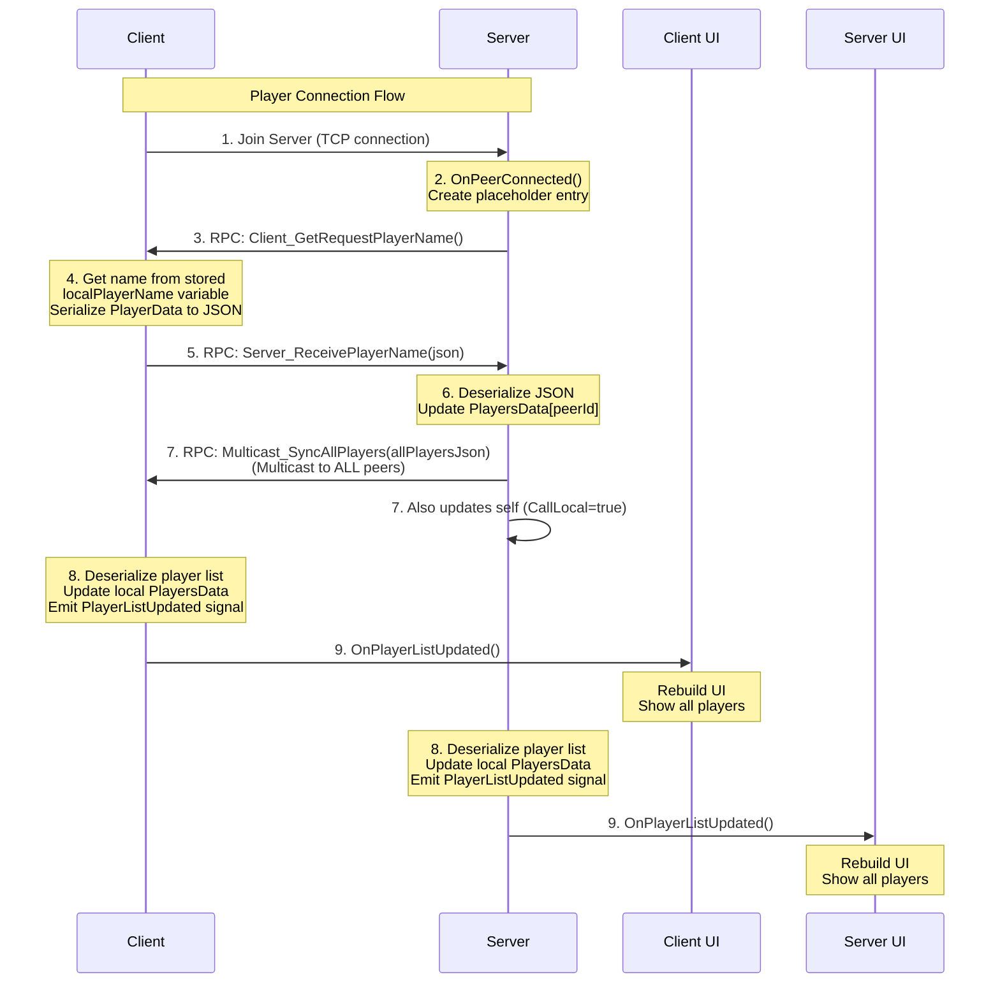
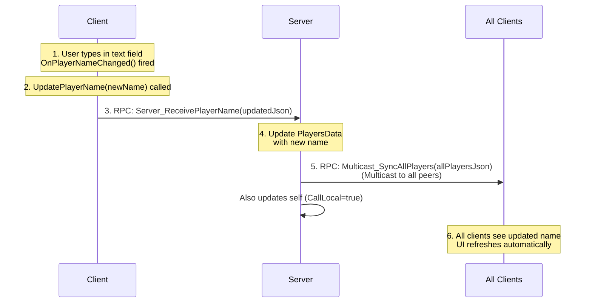
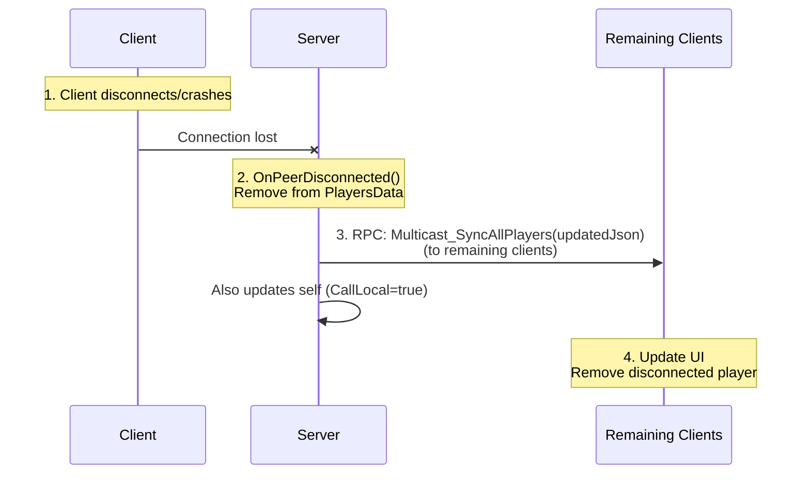

## Complete Flow Diagram

```mermaid
sequenceDiagram
    participant Client
    participant Server
    participant ClientUI as Client UI
    participant ServerUI as Server UI

    Note over Client,Server: Player Connection Flow
    
    Client->>Server: 1. Join Server (TCP connection)
    
    Note over Server: 2. OnPeerConnected()<br/>Create placeholder entry
    
    Server->>Client: 3. RPC: Client_GetRequestPlayerName()
    
    Note over Client: 4. Get name from stored<br/>localPlayerName variable<br/>Serialize PlayerData to JSON
    
    Client->>Server: 5. RPC: Server_ReceivePlayerName(json)
    
    Note over Server: 6. Deserialize JSON<br/>Update PlayersData[peerId]
    
    Server->>Client: 7. RPC: Multicast_SyncAllPlayers(allPlayersJson)<br/>(Multicast to ALL peers)
    Server->>Server: 7. Also updates self (CallLocal=true)
    
    Note over Client: 8. Deserialize player list<br/>Update local PlayersData<br/>Emit PlayerListUpdated signal
    
    Client->>ClientUI: 9. OnPlayerListUpdated()
    Note over ClientUI: Rebuild UI<br/>Show all players
    
    Note over Server: 8. Deserialize player list<br/>Update local PlayersData<br/>Emit PlayerListUpdated signal
    
    Server->>ServerUI: 9. OnPlayerListUpdated()
    Note over ServerUI: Rebuild UI<br/>Show all players
```

## Name Update Flow

```mermaid
sequenceDiagram
    participant Client
    participant Server
    participant AllClients as All Clients

    Note over Client: 1. User types in text field<br/>OnPlayerNameChanged() fired
    
    Note over Client: 2. UpdatePlayerName(newName) called
    
    Client->>Server: 3. RPC: Server_ReceivePlayerName(updatedJson)
    
    Note over Server: 4. Update PlayersData<br/>with new name
    
    Server->>AllClients: 5. RPC: Multicast_SyncAllPlayers(allPlayersJson)<br/>(Multicast to all peers)
    Server->>Server: Also updates self (CallLocal=true)
    
    Note over AllClients: 6. All clients see updated name<br/>UI refreshes automatically
```

## Disconnection Flow

```mermaid
sequenceDiagram
    participant Client
    participant Server
    participant RemainingClients as Remaining Clients

    Note over Client: 1. Client disconnects/crashes
    
    Client-xServer: Connection lost
    
    Note over Server: 2. OnPeerDisconnected()<br/>Remove from PlayersData
    
    Server->>RemainingClients: 3. RPC: Multicast_SyncAllPlayers(updatedJson)<br/>(to remaining clients)
    Server->>Server: Also updates self (CallLocal=true)
    
    Note over RemainingClients: 4. Update UI<br/>Remove disconnected player
```